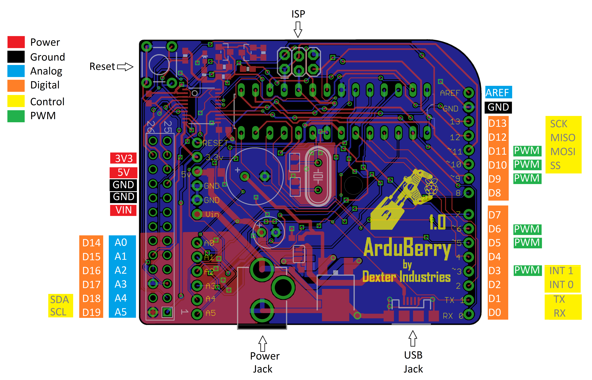

## **Arduberry**
This project combines the brains of a Raspberry Pi with the brawn of an Arduino.  [Read more about the Arduberry here.](http://www.dexterindustries.com/Arduberry)


These files have been made available online through a [Creative Commons Attribution-ShareAlike 3.0](http://creativecommons.org/licenses/by-sa/3.0/) license.

## Getting Started

We've devoted some serious time to trying to make sure that it's easy to get started.  If you're lost, we would like to first direct you to our [website for the Arduberry] (http://www.dexterindustries.com/Arduberry/)

## This Repository

This repository only holds firmware and hardware designs.  
**Python** - If you're looking for our Arduberry Python libraries, look here:	https://github.com/DexterInd/Arduberry
	
**C** - If you're looking for the Arduberry C Libraries, look here: 		https://github.com/DexterInd/Arduberry
	
**Scratch** - If you're looking for the Arduberry Scratch libraries, look here:	https://github.com/DexterInd/Arduberry

**Script** - If you're looking for the Arduberry Scripts for installing the softwares and other settings on the Raspberry PI, look here:	https://github.com/DexterInd/ArduBerry/tree/master/script

## Quick Install

In order to quick install the `Arduberry` repository, open up a terminal and type the following command:
```
sudo curl -L dexterindustries.com/update_arduberry | bash
```
The same command can be used for updating the `Arduberry` to the latest version.

## Image for the SD Card
Our custom image for the Raspberry Pi makes using the Arduberry easy. You can download the latest image [here.](http://www.dexterindustries.com/howto/raspberry-pi-tutorials/install-raspbian-for-robots-image-on-an-sd-card/)
	
## Firmware
The board firmware is made in Arduino in order to make it super-hackable.  The firmware is written in Arduino 1.0 and can be uploaded directly from the Raspberry Pi itself .

The board supports most of the Arduino sensors and shields and can interact with the Raspberry Pi via I2C and Serial and SPI is used for code burning.

## Pin Description


## Uploading the Code to Arduberry
Select the programmer as "Raspberry Pi GPIO"and Use CTRL + Shift + U to Upload the Code to the Arduberry


[Dexter Industries](http://www.dexterindustries.com/).
[Arduberry.] (http://www.dexterindustries.com/Arduberry)
